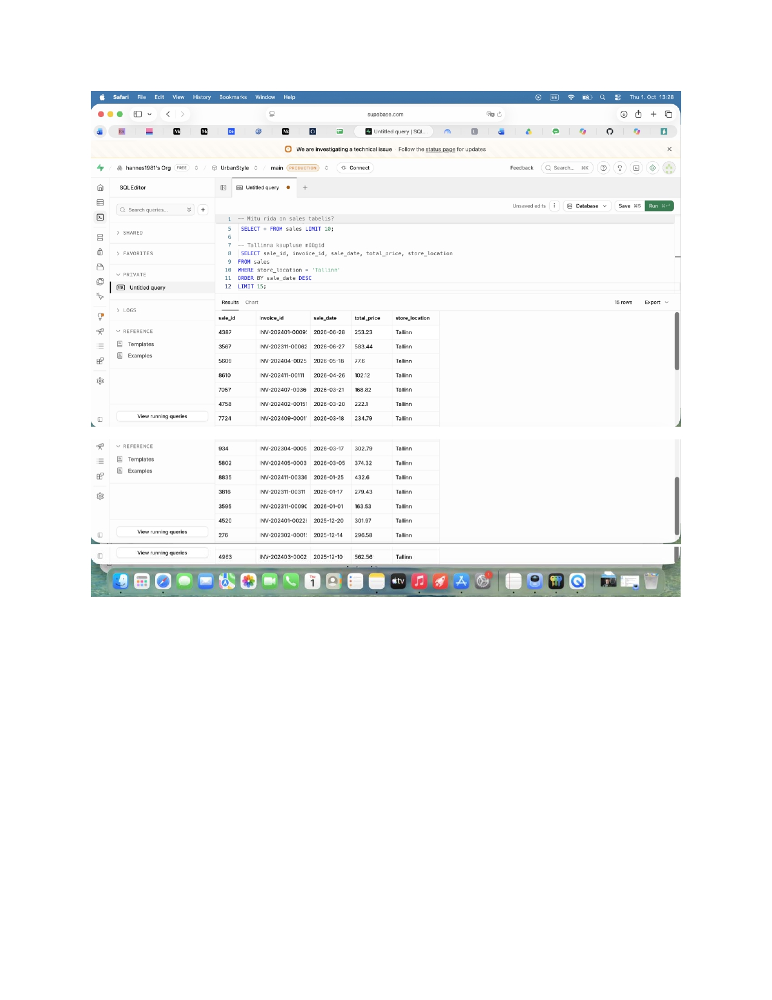

# Nädal 1: SQL Basics – Müügiandmed (Roll A)

## Ülevaade ja peamised tulemused

Uurisin `sales` tabeli andmeid Supabase andmebaasis, et kaardistada müügitehingute mahtu, summasid ja võimalikud andmekvaliteedi erandid.

### Peamised leidude numbrid:
* **Andmete üldmaht:** `sales` tabelis on kokku **15 234 tehingut**.
* **Suurim tehing:** Kalleim üksikost oli **2 170,40 €** (tõenäoliselt hulgimüük või äriklient).
* **Tagastused ja erandid:** Andmetes on **305 negatiivse summaga rida**, mis viitavad toodete tagastustele või tühistatud tehingutele.
* **Puuduvad kliendiprofiilid:** **1 487 müügitehingul puudub kliendi ID** (`customer_id IS NULL`), mis tähendab, et umbes 10% ostusid tehti ilma kliendikaardita.

---

## Suurim üllatus

Suurimaks üllatuseks oli see, et ligi 10% kõigist müügitehingutest on teostatud anonüümselt (ilma kliendikaardita) ning tabelis esineb sadu negatiivse summaga rida, mis võivad käibearuandeid moonutada, kui neid eraldi ei filtreerita.

---

## Soovitus Toomasele

Soovitan Toomasel enne finantsaruannete kinnitamist täpsustada, kuidas kassa- ja veebisüsteem käsitlevad tagastusridasid, ning kaaluda kampaaniat või tehnilist muudatust, mis motiveeriks kliente igal ostul kliendikaarti kasutama.

---

## Päringu tulemuste pilt

 (week1_result_2.jpg) (week1_result_3.jpg) (week1_results_screenshot.jpg)

